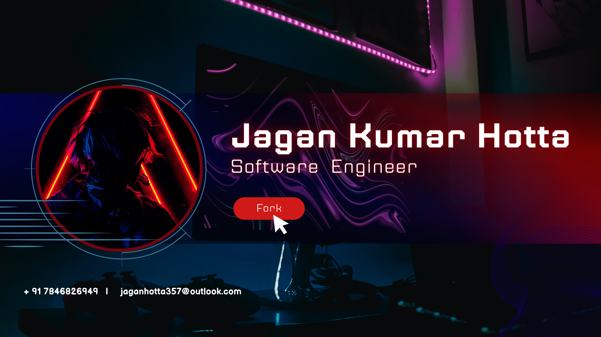

  

<h1 align="center">🙏 नमः विद्या! 👋</h1>

<h3 align="center">Backend Systems Engineer · Data Infrastructure Architect · DevOps/Kubernetes Practitioner · Open Source Contributor</h3>

  
  
  

---

## About Me

I'm a **Computer Science undergraduate and backend systems engineer** working across **Go, Python, Kubernetes, data infrastructure, and AI-assisted cloud-native systems**. My work sits at the intersection of production backend engineering, distributed data pipelines, and infrastructure automation — where systems must be observable, secure, scalable, and correct under real operational pressure.

My core focus is **backend architecture and data flow**: how information moves through APIs, queues, databases, event streams, validation layers, and dashboards. I have worked on Go-based backend services, Kubernetes-backed deployments, real-time telemetry systems, payment-style correctness flows, and AI/LLM integration layers where structured output, safety, and testing matter as much as feature delivery.

I've delivered across **government maritime surveillance, backend platform engineering, fintech-style orchestration, AI-powered automation, and data engineering consulting**. Across these projects, I’ve handled not only implementation but also architecture discussions, infrastructure choices, production constraints, stakeholder communication, and test-driven delivery.

**What genuinely excites me:**
- The elegance of a perfectly modeled data pipeline
- Business metrics that are *trusted* because the data infrastructure beneath them is bulletproof
- Neural network architectures applied to real operational problems
- Systems that are still running flawlessly three years after I've moved on
- Go-based backend systems with clean interfaces, strong tests, and production-ready failure handling
- Kubernetes-native platforms where services, observability, and deployment workflows are designed from day one
- AI systems that treat model output as untrusted until validated through schemas, contracts, and 

> *"The goal is not just working software — it is backend and infrastructure that teams can trust, operate, extend, and reason about even under scale, failure, and ambiguity."*

📫 `jaganhotta357@outlook.com`

---

## Experience

| Role | Organization | Period | Focus |
|------|-------------|--------|-------|
| 🔵 **Data Engineering Intern** | Deloitte | Current | Data pipelines, ETL/ELT orchestration, cloud data warehousing, business metrics infrastructure |
| | 🟢 **Freelance Backend & Data Engineer** | Odisha Coastal Police (Maritime Platform) | Ongoing | Go/Python backend services, Kubernetes deployments, real-time GPS telemetry, Kafka, TimescaleDB, PostGIS, observability |
| 🟣 **Software Engineer** | ConvertAPI | Past | Go backend engineering, API design, TDD, microservices architecture, reliability-focused service development ||
| 🟢 **Contributor** | HCW-HOME | Jun 2025 – Oct 2025 | NestJS, WebRTC, Mediasoup, Prisma, WebSockets, Kubernetes |
| 🟡 **Cloud Lead** | E-Labs | Jan 2025 – Present | Git workflows, CI/CD, Infrastructure as Code, monitoring dashboards |
| 🟢 **DevOps Intern** | LectureNotes | Past | Docker, AWS, Jenkins, automated deployments |
| 🔴 **Backend Developer** | Zinfytech | Past | API backends, workflow optimization |
| 🟠 **Apprentice** | Quant Finance Cohort 2024 | 2024 | Statistical modeling, Python, financial analytics |

---

## Featured Projects

### 🏦 [AegisPay](https://github.com/techySPHINX/aegispay) — Enterprise Payment Orchestration Platform
An event-sourced, distributed payment processing system engineered for **10,000+ TPS** with mathematical guarantees against duplicate charges.

**Architecture highlights:** Distributed locking via Redis (Redlock), CQRS with full event sourcing, intelligent gateway routing with automatic failover, idempotency keys at every API boundary, PostgreSQL with optimistic concurrency control. The system treats financial correctness as a hard invariant — not a soft requirement.

**Business impact:** Zero duplicate charge incidents, deterministic audit trail for every transaction, designed for regulatory compliance from day one.

`Go · PostgreSQL · Redis · Kafka · Docker · Event Sourcing · CQRS`

---

### 🚢 Odisha Coastal Police Maritime Surveillance Platform *(Freelance)*
A government-grade, real-time maritime situational awareness system designed for coastal monitoring and operational decision-making across Odisha’s fishing and marine zones.

**Architecture highlights:** Go/Python backend services for ingestion and operational APIs, Kafka-based telemetry pipeline, TimescaleDB for time-series storage and compression, PostGIS for geospatial analytics and zone-breach detection, Kubernetes for service deployment and scaling, and Prometheus/Grafana dashboards for operational visibility.

**Data pipeline design:** Raw GPS telemetry → backend ingestion services → Kafka partitioned by vessel/device identity → stream processing for anomaly and zone detection → TimescaleDB/PostGIS persistence → WebSocket/API delivery to operator dashboards. The architecture focuses on low-latency tracking, geospatial correctness, and resilient field operations.

`Go · Kafka · TimescaleDB · PostGIS · Kubernetes · WebSockets · Prometheus · Grafana`

---

### ⚙️ ConvertAPI Backend Systems *(Professional Work)*
Backend engineering work focused on API reliability, service boundaries, and test-driven delivery for conversion-oriented workflows.

**Engineering focus:** Go-based backend services, API contract design, request validation, modular service structure, error handling, and test coverage. The work strengthened my practical understanding of production backend engineering: keeping interfaces clean, failures explicit, and services maintainable under real usage.

`Go · APIs · TDD · Microservices · Backend Architecture · Reliability Engineering`

---

### 🤖 [Nexus](https://github.com/techySPHINX/Nexus) — AI-Enhanced Student Collaboration Network
A full-stack student networking platform combining real-time communication infrastructure with **AI-powered features**: intelligent content recommendations using embedding-based similarity search, automated moderation using fine-tuned classification models, and a RAG-based knowledge assistant trained on academic resources.

**Technical depth:** WebSocket-based messaging with Redis pub/sub fanout, JWT + RBAC authentication, PostgreSQL/Prisma backend, LangChain integration for semantic search, vector embeddings stored in pgvector, deep learning text classification pipeline for content quality scoring.

`TypeScript · NestJS · PostgreSQL · Redis · LangChain · pgvector · WebSockets · PyTorch`

---

### 🧠 Deep Learning & AI Systems *(Research & Production)*
A collection of applied AI/ML work spanning computer vision, NLP, and intelligent automation:

- **Neural Network Pipelines**: End-to-end training pipelines with MLflow experiment tracking, automated hyperparameter tuning, and model versioning — designed for reproducibility and production deployment
- **RAG Architectures**: Retrieval-augmented generation systems with custom chunking strategies, embedding model fine-tuning, and hybrid dense-sparse retrieval
- **LLM Integration Layer**: Multi-provider abstraction (OpenAI, Anthropic, local models) with semantic caching, token budget management, and structured output validation using Pydantic
- **Data-Driven ML Ops**: Feature stores built on Apache Arrow/Parquet, training data versioning with DVC, automated drift detection on production models

`Python · PyTorch · TensorFlow · LangChain · MLflow · DVC · Hugging Face · FastAPI`

---

### 📊 Data Infrastructure & Business Intelligence Work
Recurring theme across client engagements: organizations have data but lack the infrastructure to trust it.

- **ELT Pipelines**: dbt-based transformation layers on top of raw event data, with automated data quality checks (Great Expectations), lineage tracking, and business metric definitions as code
- **Streaming Analytics**: Flink/Kafka Streams jobs computing real-time business KPIs — revenue per cohort, funnel conversion, churn signals — with sub-minute latency
- **Observability as Data**: Custom Prometheus exporters turning application behavior into structured business metrics, feeding executive dashboards built in Grafana
- **Data Contracts**: Schema registry enforcement across microservice boundaries to prevent silent data corruption in distributed pipelines

`Apache Kafka · dbt · Apache Flink · Airflow · Prometheus · Grafana · PostgreSQL · TimescaleDB · Parquet`

---

## Current Focus

- 🧩 **Go Backend Engineering** — clean interfaces, service boundaries, concurrency patterns, API design, and test-driven backend development
- ☸️ **Kubernetes & Cloud-Native Systems** — deployments, service reliability, observability, containerized workflows, and platform engineering fundamentals
- ☁️ **Advanced Data Engineering at Deloitte** — cloud-scale ETL, warehousing patterns, business metric instrumentation, and production data pipelines
- 🤖 **AI/LLM Infrastructure** — provider abstraction, structured output validation, BYOM patterns, local/private inference, and schema-safe AI workflows
- 🕸️ **Open Source Contribution** — currently studying Meshery adapter architecture, meshkit, meshery-adapter-library, protobuf boundaries, Connections/Credentials, and test-first contribution paths
- 📐 **Systems Design** — distributed systems, database internals, event-driven architecture, observability, and reliability engineering

---

## Open Source Focus

I am currently focusing on **cloud-native open-source systems**, especially projects where architecture, interfaces, testing, and extensibility matter. My current contribution direction is around Meshery’s AI Adapter / AI Connections work, where I am studying adapter boundaries, BYOM provider design, Connections/Credentials, schema-validated design generation, and test-driven implementation before touching major feature code.

My approach to open source is design-first: understand the existing architecture, identify the safest integration boundary, contribute small preparatory improvements, and then move toward implementation with tests and maintainability in mind.

---

## Achievements

- 🥈 **Runner-up** — Smart India Hackathon 2024 (SIH'24)
- 🌟 **Selected Contributor** — C4GT-DMP-2025 @ Iabsis (open-source)
- 🚀 **Selected** — KPI Fellowship Program 2025
- 🏆 **Finalist** — Buildfest 2025
- 📊 **Apprentice** — Quant Finance Cohort 2024
- ☁️ **Cloud Lead** — E-Labs, driving technical community workshops
- 🤝 **Member** — Google Developer Group Cloud Bhubaneswar
- 👨‍💻 Professional experience across Deloitte, ConvertAPI, LectureNotes, Zinfytech

---

## Tech Stack

**Languages**  
`Go · Python · TypeScript · JavaScript · C++ · SQL`

**Backend & APIs**  
`Go backend services · FastAPI · NestJS · Express · Node.js · REST APIs · gRPC · WebSockets · Microservices`

**Cloud-Native & DevOps**  
`Kubernetes · Docker · Terraform · Helm · AWS · Azure · GitHub Actions · Jenkins · GitLab CI · Linux`

**Data Infrastructure**  
`Apache Kafka · Apache Flink · Apache Airflow · dbt · TimescaleDB · PostgreSQL · PostGIS · Redis · MongoDB · Supabase · Parquet`

**AI & ML Systems**  
`PyTorch · TensorFlow · LangChain · Hugging Face · MLflow · DVC · pgvector · Apache Arrow · LLM Integration · RAG`

**Observability**  
`Prometheus · Grafana · OpenTelemetry · Jaeger · Structured Logging`

**Frontend**  
`React · Next.js · Angular · Redux`

---

## GitHub Stats

&nbsp;

---

*Building systems where data integrity is non-negotiable, scale is engineered from the start, and every business metric has a trustworthy pipeline behind it.*

**If something here resonates — let's build something that matters.**

💬 Always open to conversations, collaborations, and hard engineering problems.

