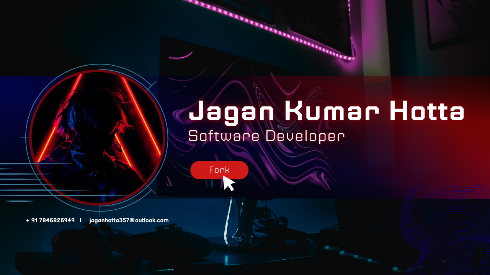

  

<h1 align="center">🙏 नमः विद्या! 👋</h1>

<h3 align="center">🚀 Software Developer • ⚙️ Backend Engineer • ☁️ DevOps Enthusiast • 🌍 Open Source Contributor</h3>

  
  
  

---

## 🚀 About Me

🎓 CS Undergrad • 🧠 Lifelong Learner • 💡 Tech Community Builder  
💻 Backend Dev | ☁️ Cloud Native | 🔧 DevOps | 🐍 Pythonista | ⚛️ React Enthusiast

- 👨‍💻 Proficient in **Node.js, NestJS, Express.js, FastAPI, Flask**
- ☁️ Cloud lover exploring **AWS | Docker | Kubernetes | CI/CD**
- 🧪 Built microservices, automation scripts, and scalable APIs
- 🧠 Competitive Programming in **C++**, brushing up **Data Structures**
- 👨‍🏫 Mentoring juniors, writing on Medium & contributing to FOSS
- 📫 **Reach me at:** `jaganhotta357@outlook.com`
- 🪐 Fun Fact: There are as many people on 🌍 as stars you can see in the 🌌!

---

## 🏆 Experience Highlights

| 🔰 Role | 🏢 Company | 🛠️ Stack & Contribution |
|--------|-----------|--------------------------|
| 🟡 **Cloud Lead** | E-Labs (Jan 2025 – Present) | Git, CI/CD, Infra as Code, Dashboards |
| 🟣 **Intern** | ConvertAPI | FastAPI, TDD, Microservices |
| 🟢 **DevOps Intern** | LectureNotes | Docker, AWS, Jenkins |
| 🔴 **Backend Dev** | Zinfytech | API Backends, Workflow Optimization |
| 🟠 **Apprentice** | Quant Finance Cohort'24 | Stats, Python, Analytics |

---

## 🎯 Current Goals

🎯 Pushing Boundaries – Here’s what I’m working on:

- ☁️ Advanced Cloud-Native Deployments (K8s, Terraform, EKS)
- 🧠 Build AI-powered apps using **LangChain**, **OpenAI Tools**
- 💡 Learn about **AI Agents**, **MCP**, and **Semantic Memory**
- 🕸️ Build full-stack Web3 dApps using Next.js + StarkNet
- 🧩 Practice daily CP using **C++ STL & Template Meta-Programming**

---

## 🏅 Achievements & Highlights

🏆 Some proud milestones from my journey:

- 🥈 **Runner-up** @ SIH’24 (Smart India Hackathon)
- 📊 **Apprentice** @ Quant Finance Cohort 2024
- ☁️ **Cloud Lead** @ E-Labs, driving community workshops
- 👨‍💻 Interned at **ConvertAPI**, **LectureNotes**, **Zinfytech**
- 🤝 Member of **Google Developer Group Cloud Bhubaneswar**

---

## 🌐 Connect With Me

  
  
  

---

## ⚙️ Tech Stack & Tools

### 💻 Languages, Frameworks & Platforms

  
  
  
  
  
  
  
  

  

### ☁️ DevOps & Cloud

  
  
  
  
  
  

### 📊 Data & AI/ML

  
  
  
  
  

### 🧰 Tools of the Trade

  
  

  

---

## 🏆 GitHub Trophies

  

---

## 📈 GitHub Stats

  

  

---

  ✨ If you found something interesting, don't forget to leave a ⭐ on my repos!  
   💬 Always open to conversations, ideas & collabs!

